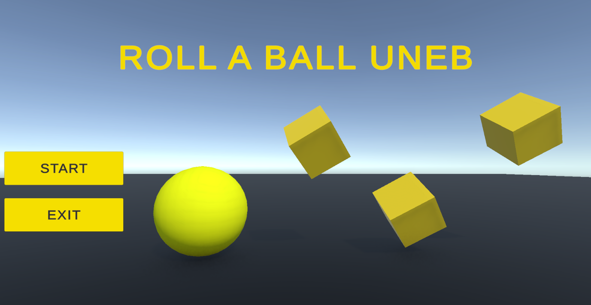
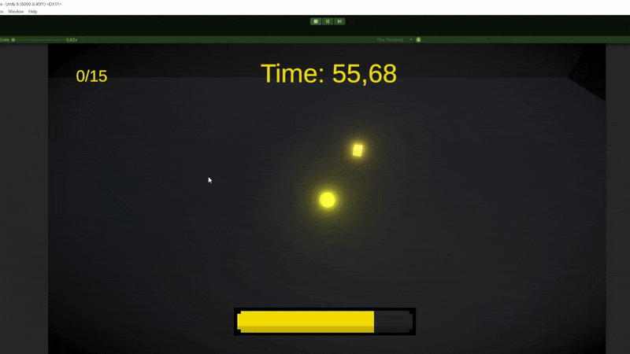

# Roll a Ball Game UNEB

## 🎮 Descrição

Controle a bola usando **WASD** para coletar **34 itens** antes que o tempo termine (**60 segundos**) ou a vida acabe.  

- A vida e o brilho da bola diminuem com o tempo.  
- Ao coletar itens, a vida e o brilho da bola aumentam.  
- Planeje seus movimentos para coletar todos os itens antes do tempo acabar!  

---

Jogue diretamente no navegador: [Roll a Ball UNEB no Unity Play](https://play.unity.com/en/games/40142ebf-445a-4b4e-8abf-6fe8eee7b1d1/roll-a-ball-uneb)

## 🖼️ Print do Jogo

---

## 🎥 Gameplay GIF

---

## ⚙️ Controles

- **W / A / S / D** → Mover a bola  
- **Objetivo** → Coletar 15 itens antes do tempo acabar  

---

## 📝 Observações

- Tempo limite: **60 segundos**  
- A vida da bola diminui constantemente e aumenta ao pegar itens  
- Brilho da bola acompanha a vida  

---

> Você pode personalizar o README colocando links para **Unity Play**, **YouTube** ou qualquer outro lugar onde o jogo esteja hospedado.
